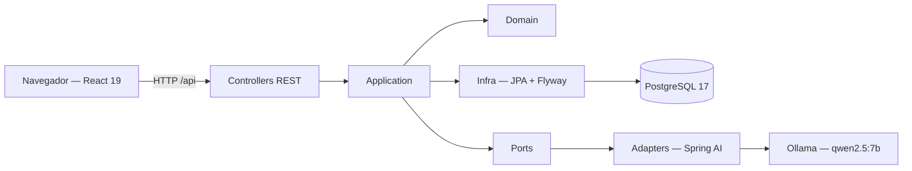

# AI Task Manager

Gerenciador de tarefas com IA: CRUD de tarefas e subtarefas, análise e melhoria
de tarefas por LLM, decomposição automática em subtarefas e um assistente
conversacional que responde com dados reais via tool calling.

## Descrição

O projeto é um desafio de "AI Task Manager" dividido em frontend React, backend
Spring Boot e serviços auxiliares (PostgreSQL e Ollama) orquestrados pelo Docker
Compose. As funcionalidades de IA são três: melhorar tarefas (reescrever título e
descrição), analisar tarefas (sugerir prioridade, complexidade, horas e
justificativa) e decompor tarefas em subtarefas — todas com resposta validada e
retry. Há ainda um assistente conversacional por conversa, com grounding nas
ferramentas do próprio sistema (nada de escrita descontrolada: as ferramentas são
somente-leitura).

O contrato JSON é em português (RF-24), o envelope de erro segue a RFC 7807
(`ProblemDetail`), e toda resposta de erro leva `traceId` e `timestamp` para
correlação com o log.

## Tecnologias

**Backend** (`backend/`):

- Java 21, Spring Boot 4.1.1, Spring Web MVC (`context-path: /api`)
- Spring AI 2.0.1 com provider **Ollama** (`spring-ai-starter-model-ollama`)
- Spring Data JPA, Flyway (`spring-boot-flyway` + `flyway-database-postgresql`), PostgreSQL 17
- Testcontainers 2.0.5 + `spring-boot-webmvc-test` (testes); `excludedGroups=llm`

**Frontend** (`frontend/`):

- React 19.2.8, TypeScript 6, Vite 8 (rolldown), React Router 7
- Vitest 4, Testing Library, jsdom e oxlint (testes/lint)

**Infra**

- Docker Compose: `postgres`, `ollama` (serviço `ollama-pull` one-shot baixa o
  modelo), `backend` e `frontend` (nginx servindo o build estático)

Sem UI kit, sem lib de estado global, sem lib de forms. Toda biblioteca extra além
do scaffold é justificada em "Decisões técnicas".

## Arquitetura

Backend em camadas protegidas (`api → application → domain → infra`), com o Spring
AI confinado em `ai.adapter` e acessado por portas (`TaskAiPort`, `AssistantPort`).
Frontend é SPA React consumindo a API REST. Postgres e Ollama são serviços do
Compose; nginx faz proxy de `/api` para o backend.



O diagrama completo (componentes + fluxo de chamada de IA + fluxo do assistente com
tool calling) está em [`docs/architecture.md`](docs/architecture.md).

## Configuração do LLM

- **Provider:** Ollama. Dentro do compose o backend aponta para
  `http://ollama:11434` (host do serviço). Para usar um Ollama fora do Docker,
  troque `OLLAMA_BASE_URL` para `http://host.docker.internal:11434` no `.env`.
- **Modelo:** `qwen2.5:7b` (padrão, verificado com tool calling real). Alternativa
  com suporte a tool calling: `llama3.1:8b`. Definido por `AI_MODEL`.
- **Configuração:** `AI_TIMEOUT` (timeout de conexão/leitura), `AI_MAX_RETRIES`
  (tentativas extras quando a resposta é inválida), `ASSISTANT_TOOL_CALLING`
  (liga/desliga o registro das ferramentas do assistente; desligado, injeta um
  contexto pré-montado no prompt como fallback).
- **Como rodar:** `docker compose up --build` já levanta o Ollama e o one-shot
  `ollama-pull` baixa o `$AI_MODEL` no volume `ollama-data` antes de liberar o
  backend. Rodando o backend fora do Docker, use `scripts/ollama-pull.sh` (exige
  um Ollama acessível em `OLLAMA_HOST`, padrão `http://localhost:11434`).
- **Respostas:** structured output via `ChatClient.responseEntity(Class)` (o JSON
  Schema chega no prompt), validação obrigatória pelo `LlmResponseValidator` e
  retry com instrução de correção em `SystemMessage`; falhas viram 502/503 com
  `detail` fixo e a causa só no log.

## Execução

Pré-requisito: Docker com o plugin Compose.

```bash
cp .env.example .env   # ajuste se necessario (defaults ja funcionam)
docker compose up --build
```

- Frontend: http://localhost:8081
- API: http://localhost:8080/api (healthcheck em `/api/health`)
- Na primeira subida o `ollama-pull` baixa o `qwen2.5:7b` (~4,7 GB), pode demorar.

**Sem Docker** (dev):

```bash
# backend (Java 21 + Maven): requer Postgres e Ollama acessiveis
mvn spring-boot:run

# frontend (origem http://localhost:5173 ja liberada no CORS)
npm install
npm run dev
```

**Testes:**

```bash
cd backend && mvn -q test            # 227 testes, 0 falhas
cd frontend && npm run lint && npm run test && npm run build
```

## Recursos de IA

**Prompts** versionados em `backend/src/main/resources/prompts/` (StringTemplate):
`task-improve.st`, `task-analyze.st`, `task-decompose.st` e `assistant-system.st`.

**Funcionalidades:**

- `POST /api/ai/tasks/improve` — sugere novo título/descrição para uma tarefa
  (nada é persistido; o usuário aplica pela UI).
- `POST /api/ai/tasks/{id}/analyze` — analisa e sugere prioridade, complexidade,
  horas estimadas e justificativa (nunca altera a tarefa automaticamente).
- `POST /api/ai/tasks/{id}/decompose` — sugere subtarefas;
  `POST /api/ai/tasks/{id}/decompose/apply` cria as selecionadas sob o pai (201 +
  `Location`), validando cada item na borda (1..10 itens, título ≤ 200).
- `POST /api/assistant/chat` — assistente por conversa: sem `conversationId` cria
  uma conversa nova; com id retoma o histórico (janela de 20 mensagens) ou 404.

**Processamento das respostas:** o JSON do modelo é sempre convertido por
`responseEntity(Class)` e validado (`LlmResponseValidator`). Resposta inválida
dispara retry com a correção como `SystemMessage`; esgotado, vira
`InvalidLlmResponseException` → 502 `code: LLM_INVALID_RESPONSE`. Erro de
comunicação → 502 (ERR-03); Ollama indisponível (conexão recusada) → 503 (ERR-05);
o serviço persiste o turno do assistente **só depois** da resposta.

**Tool calling:** o assistente registra 6 ferramentas **somente-leitura**
(`get_pending_tasks`, `get_overdue_tasks`, `get_task_by_id`, `get_tasks_by_priority`,
`get_tasks_due_soon`, `get_task_summary`) cortadas por `app.assistant.max-tool-results`.
O prompt de sistema manda responder APENAS com dados das ferramentas, injeta a data
atual pelo backend e recusa assuntos fora de tarefas. O `qwen2.5:7b` foi verificado
com `message.tool_calls` reais; se o modelo não suportar tool calling, o toggle
`app.assistant.tool-calling` permite cair para o fallback de contexto.

## Decisões técnicas

**Bibliotecas extras e justificativa** (RNF-05):

- `spring-ai-starter-model-ollama` (Spring AI BOM) — integração com o provider
  Ollama: structured output, tool calling e tradução de erros de transporte.
  É a única dependência de IA; a camada de negócio só conversa com as portas.
- `react-router-dom` — roteamento das três telas (Dashboard, Tarefas, Assistente),
  exigido por RF-20/RF-21/RF-22.
- `vitest` + `@testing-library/react` + `@testing-library/jest-dom` +
  `@testing-library/user-event` + `jsdom` — base de testes do frontend (TST-02).
- `oxlint` — lint rápido, já vem do template Vite.
- `spring-boot-flyway` + `flyway-database-postgresql` — no Boot 4 o autoconfiguration
  do Flyway é um módulo separado do `flyway-core`; sem ele o schema não migra.
- `spring-boot-webmvc-test` — o `@WebMvcTest`/MockMvc saem deste módulo no Boot 4.
- `testcontainers-junit-jupiter` + `testcontainers-postgresql` — testes de
  integração com Postgres real (compartilhado entre as suítes).

**Decisões de arquitetura e contrato** (detalhe completo no `.specs/`):

- JSON público em português (RF-24) com envelope de erro em inglês (RFC 7807 —
  `type/status/title/detail` + `traceId`/`timestamp`), sem stack trace no corpo.
- `context-path: /api` no servidor; CORS fechado por lista explícita de origens.
- Regras de domínio: `CONCLUIDA` é terminal (reabrir passa por `A_FAZER`); excluir
  um pai remove as subtarefas em cascata (a UI confirma listando as filhas).
- `TraceIdFilter` gera 16 hex na primeira fronteira (header `X-Trace-Id` + MDC); o
  `ProblemDetail` de toda resposta de erro — inclusive os 502/503 de IA — herda
  `traceId` e `timestamp`.
- Ia valida sempre: `max-title-length`/`max-text-length`/`max-horas` espelham os
  limites do banco nos prompts e no Bean Validation.
- Testes de IA usam um `ChatModel` falso roteirizado (sem LLM real no build
  `excludedGroups=llm`); o resultado é validado por um fake que provaria o contrato
  das portas mesmo trocando de provider.