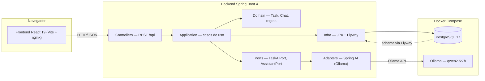
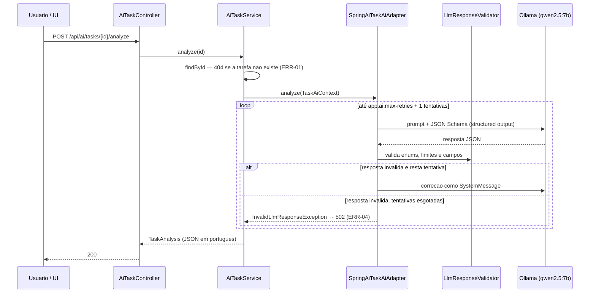
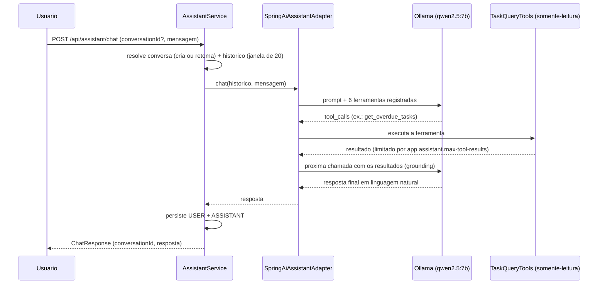

# Arquitetura — AI Task Manager

## Visão geral

A aplicação é frontend React consumindo uma API REST do backend Spring Boot. O
backend é organizado em camadas protegidas: `api` (controllers REST), `application`
(casos de uso), `domain` (regras de negócio) e `infra` (JPA/Flyway). O Spring AI
fica confinado no pacote `ai.adapter`, acessado pelas aplicações através de portas
(`TaskAiPort`, `AssistantPort`) — nenhuma camada de negócio importa Spring AI.

O Postgres e o Ollama (com o modelo `qwen2.5:7b`) rodam como serviços do Docker
Compose junto com o backend e o frontend (nginx).

## Fluxo de uma chamada de IA (análise de tarefa)

Exemplo do endpoint `POST /api/ai/tasks/{id}/analyze`: o adapter monta o prompt
com o schema do structured output (via `ChatClient.responseEntity(Class)`), o
modelo responde JSON e o `LlmResponseValidator` valida sempre; resposta inválida
dispara retry com instrução de correção; esgotado, vira
`InvalidLlmResponseException` (502).

## Fluxo do assistente com tool calling

`POST /api/assistant/chat`: o assistente usa ferramentas somente-leitura
(`get_pending_tasks`, `get_overdue_tasks`, `get_task_by_id`,
`get_tasks_by_priority`, `get_tasks_due_soon`, `get_task_summary`) para responder
com dados reais. O turno (USER + ASSISTANT) só é persistido depois que a IA
responde.

## Camadas protegidas (RNF-14)

O `LayerDependenciesTest` falha se `task.domain`, `task.application`, `ai.port`,
`assistant.port` ou `assistant/application` importarem `org.springframework.ai`.
O pacote `ai.adapter` concentra todo o Spring AI (`SpringAiTaskAiAdapter`,
`SpringAiAssistantAdapter`, `AssistantToolCallbacks`, `AiAdapterConfig`).